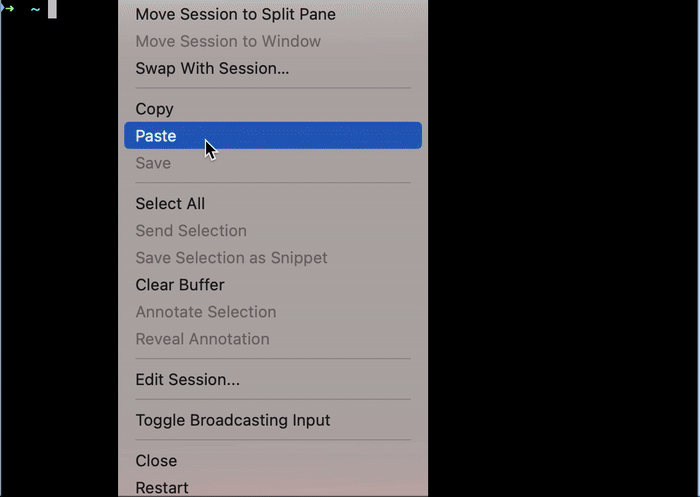

# Logmortem

Take a pile of messy, timestamped operational data from multiple sources, correlate events across them, and produce a structured, decision-ready draft that a human can validate fast — then measure whether that draft can actually be trusted. That's the pattern this tool is built around. The domain it's built in happens to be engineering incidents (root-cause analysis), but the shape — ingest scattered records → correlate → draft → **verify against acceptance criteria** — is the same one that shows up in any operational analysis.

Concretely: writing incident post-mortems by hand — digging through logs, reconstructing timelines, correlating deploys — is slow and happens when you're already exhausted. Logmortem does the first draft so a human validates and refines instead of building from scratch at 3am. Feed it a log source, a time window, and the alert that fired; it pulls the records, correlates recent deploys, and outputs a structured post-mortem in under a minute — and ships with an eval harness that grades those drafts against explicit pass/fail criteria (see [Eval results](#eval-results)) so the output is measured, not assumed.



*Real execution, `--from-fixture --dry-run` — no live AWS/GitHub needed. Shows the actual collected context (records + deploy correlation) before Claude is called.*

---

## Example output

```markdown
# ECS Service Crash — Connection Pool Exhaustion

| Field | Value |
|---|---|
| Severity | P1 |
| Start | 2026-04-08T02:00:00 |
| Duration | 45 minutes |
| Alert | ECS TaskCount dropped below threshold |

## Root Cause
DB connection pool limit (max_connections=20) was not increased when the deploy
doubled service instances from 4 to 8, exhausting available connections.

## Deploy Correlation
Commit abc12345 deployed 30 minutes before incident attempted to fix pool size
but used the wrong config key.

## Action Items
| Priority | Action | Owner |
|---|---|---|
| HIGH | Add pre-deploy check for DB connection pool headroom | platform-team |
| HIGH | Align staging DB config with production | infra |
```

---

## How it works

1. Fetches CloudWatch log events for the incident window (plus 10 min pre-window for context)
2. Pulls GitHub Actions workflow runs from the 24h before the incident
3. Filters health check noise automatically
4. Sends everything to Claude with a structured RCA prompt
5. Outputs a markdown postmortem with timeline, root cause, deploy correlation, contributing factors, and action items

---

## Limitations & what I'd do differently

- **Correlation is temporal, not causal.** A deploy 30 minutes before an
  incident gets flagged; Claude decides if it's relevant. It's a draft for
  a human to validate, not a verdict — and it can be confidently wrong.
  That risk is now measured instead of hand-waved: see
  [Eval results](#eval-results) below.
- **Logs only.** No CloudWatch Metrics or traces. Root causes that live in
  a latency graph rather than a log line get missed.
- **GitHub Actions only** for deploy history. Other CD systems are invisible.
- **Large incident windows can exceed the context budget.** Noisy log groups
  over long windows get truncated, not summarized.
- Still on the rebuild list: more log sources beyond the offline fixture
  reader, and chunked ingestion with pre-summarization instead of truncation.
  The eval harness from the original wishlist is built — see below.

---

## Eval results

`eval/harness.py` replays seeded incident fixtures (root cause known by
construction, plus deliberately innocent deploys as bait) through the real
generation pipeline and grades each draft against three acceptance criteria —
the pass/fail gates an RCA has to clear before a human should trust it:

| acceptance criterion | what it verifies |
|---|---|
| cause identified | the draft names the seeded root cause |
| no false blame | it does not pin the incident on an innocent deploy |
| fully grounded | every commit SHA it cites is a real deploy from the input |

Current numbers — 20 runs (4 fixtures × 5 passes, claude-sonnet-5, July 3–6 2026):

```
cause identified:   20/20  (100%)
no false blame:     20/20  (100%)
fully grounded:     20/20  (100%)
```

**Honest scope:** n=20 on 4 synthetic fixtures is a smoke test, not a
benchmark. The fixtures are clean by design; real incident logs are noisier,
and a perfect score here does not promise one there.

**Validating the measurement instrument before trusting it:** the first
scoring pass reported 81% cause / 88% no-false-blame. Reading the persisted
drafts (every run is saved to `eval/results/` with its full output) showed both
deficits were **grader bugs, not model failures** — the cert-expiry fixture had
grader directives polluting its scored answer text, and the blame-checker was
counting "rolled back to <commit>" (an exoneration) as an accusation. The
drafts were right; the grader was wrong. Fixing the instrument, not the number,
is the whole point — a green metric from a broken grader is worse than a red
one. The current false-blame check uses an exculpatory-phrasing window that is
still a heuristic and can over-forgive in edge cases — flagged here rather than
hidden.

Reproduce it (costs a few cents in API calls):

```bash
export ANTHROPIC_API_KEY=your_key
.venv/bin/python3 -m eval.harness            # run all fixtures once
.venv/bin/python3 -m eval.harness --summary  # cumulative stats across all saved runs
.venv/bin/python3 -m eval.harness --no-llm   # free: exercises scoring plumbing only
```

---

## Automated trigger

logmortem can run automatically when a deploy fails. Add `.github/workflows/auto-rca.yml`
to your repo and set these secrets:

| Secret | Required | Description |
|--------|----------|-------------|
| `ANTHROPIC_API_KEY` | Yes | Claude API key |
| `AWS_ACCESS_KEY_ID` | Yes | AWS credentials |
| `AWS_SECRET_ACCESS_KEY` | Yes | AWS credentials |
| `AWS_DEFAULT_REGION` | No | Defaults to us-east-1 |
| `LOG_GROUP` | No | CloudWatch log group to query |

When any workflow fails, logmortem automatically generates an RCA and posts it
to the GitHub Actions job summary — visible directly in the failed run.

---

## Usage

```bash
# Basic — logs only
python src/main.py \
  --log-group /aws/ecs/payment-service \
  --start-time 2026-04-08T02:00:00 \
  --end-time 2026-04-08T03:00:00 \
  --alert "ECS TaskCount dropped below threshold"

# With deploy correlation
python src/main.py \
  --log-group /aws/ecs/payment-service \
  --start-time 2026-04-08T02:00:00 \
  --end-time 2026-04-08T03:00:00 \
  --alert "ECS TaskCount dropped below threshold" \
  --repo your-org/your-app

# Offline — replay a seeded incident fixture, no AWS/GitHub creds needed
python src/main.py --from-fixture fixtures/pool-exhaustion.json

# Dry run — see what data was collected without calling Claude
python src/main.py \
  --log-group /aws/ecs/payment-service \
  --start-time 2026-04-08T02:00:00 \
  --end-time 2026-04-08T03:00:00 \
  --alert "ECS TaskCount dropped below threshold" \
  --repo your-org/your-app \
  --dry-run

# Custom output file
python src/main.py \
  --log-group /aws/ecs/payment-service \
  --start-time 2026-04-08T02:00:00 \
  --end-time 2026-04-08T03:00:00 \
  --alert "ECS TaskCount dropped below threshold" \
  --output incidents/2026-04-08-payment-outage.md
```

---

## Setup

```bash
git clone https://github.com/sezgiozrn/Logmortem.git
cd Logmortem
pip install -r requirements.txt
```

```bash
export ANTHROPIC_API_KEY=your_key_here
export GITHUB_TOKEN=your_github_token      # optional, for deploy correlation
```

AWS credentials via standard boto3 chain (`~/.aws/credentials`, env vars, or instance profile).

---

## Running tests

```bash
pip install pytest pytest-cov
pytest tests/ -v --cov=src --cov-report=term-missing
```

---

## Stack

- **Python** — CLI and data ingestion
- **boto3** — CloudWatch Logs
- **GitHub REST API** — Actions workflow history
- **Claude API** — RCA synthesis

---

## Related

The runbooks and postmortem templates that informed this tool live in [Platform-Runbooks](https://github.com/sezgiozrn/Platform-Runbooks) — severity levels, escalation paths, and triage steps for AWS/ECS incidents.
